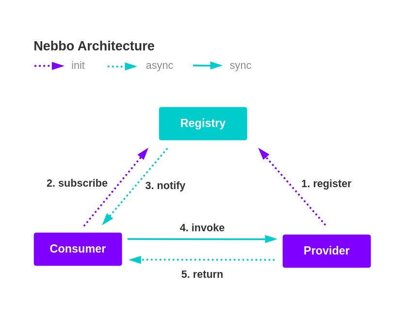

# Nebbo

Nebbo 是一款高性能, 基于 Java 的开源 RPC 框架.

## Architecture

## License

Nebbo software is licenced under the Apache License Version 2.0. See
the [LICENSE](https://github.com/neteasy-study-rpc/nebbo/blob/master/LICENSE) file for details.
